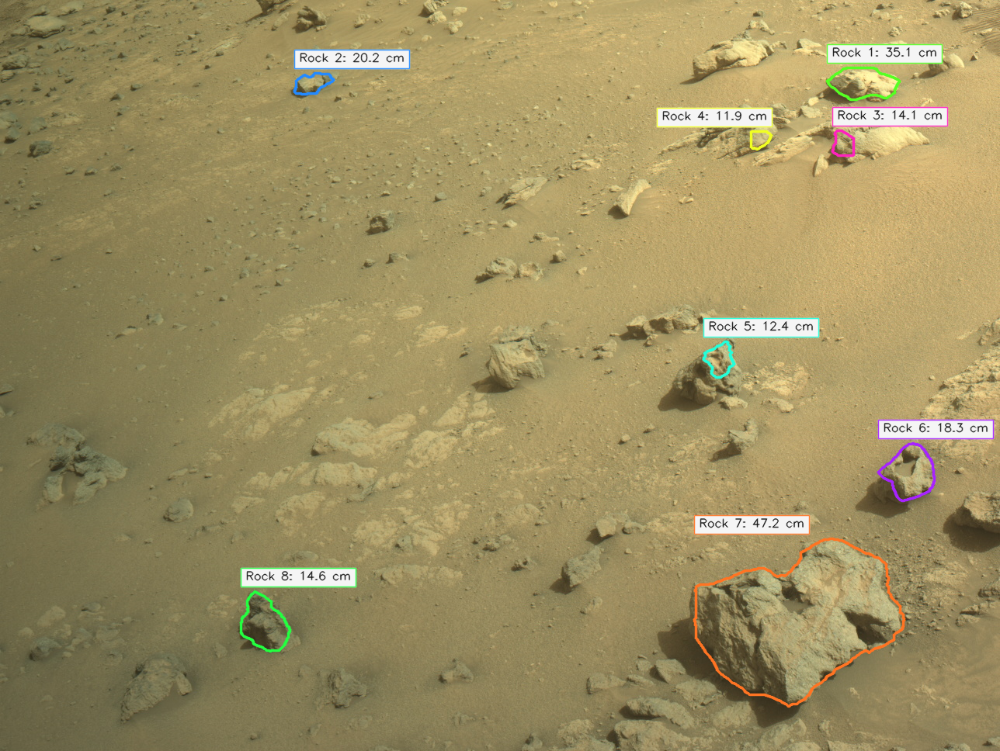
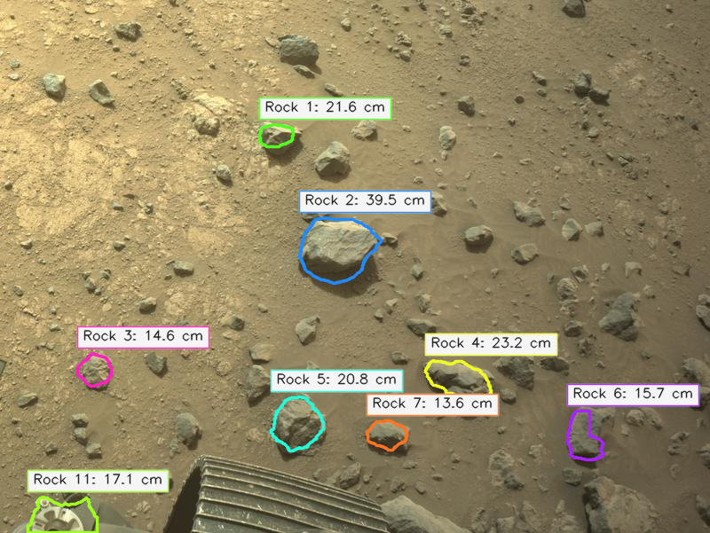
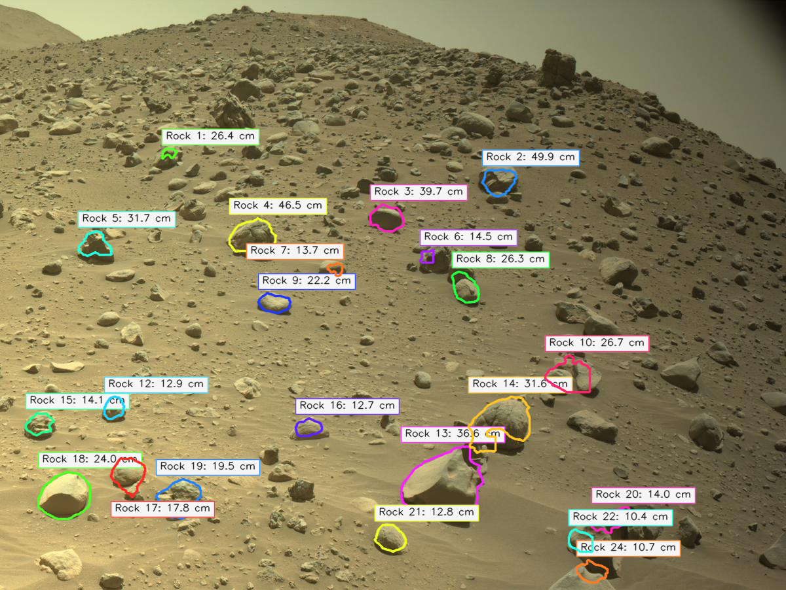
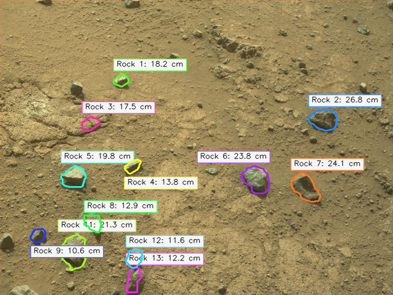

# Mars Rock Detection And Height Estimation

This repository is a small CLI project for analyzing Mars rover imagery. It segments rocks in a single image, separates individual detections, and produces heuristic per-rock size estimates, including a filtered view of rocks estimated to be taller than a chosen height threshold.

The repo already includes:

- sample rover images in `inputs/`
- trained checkpoints in `models/`
- example prediction outputs in `outputs/`
- a CLI with commands for prediction, training, and preparing the `Voxel51/S5Mars` dataset

The sample rover imagery in `inputs/` is sourced from NASA's [Mars Perseverance raw image archive](https://mars.nasa.gov/mars2020/multimedia/raw-images/).

## What The Project Does

`mars-rocks` supports three main workflows:

1. `predict`: run inference on an input image and write annotated outputs
2. `train`: train a binary rock-segmentation model from a local dataset or directly from Hugging Face through FiftyOne
3. `prepare-s5mars`: download and convert `Voxel51/S5Mars` into the local `img/` / `label/` layout used by training

Prediction produces four artifacts by default:

- an annotated overlay image
- a binary mask
- a JSON report with model, camera, summary, and per-rock metadata
- a second annotated image containing only rocks above `--min-height-cm`

## Example Height-Filtered Outputs

These are the `v6` sample images showing only rocks estimated above the default `10 cm` threshold:

Source imagery: [Mars Perseverance Raw Images](https://mars.nasa.gov/mars2020/multimedia/raw-images/)

<table>
  <tr>
    <td align="center" width="50%">
      
      <br />
      <sub><code>input1</code></sub>
    </td>
    <td align="center" width="50%">
      
      <br />
      <sub><code>input2</code></sub>
    </td>
  </tr>
  <tr>
    <td align="center" width="50%">
      
      <br />
      <sub><code>input3</code></sub>
    </td>
    <td align="center" width="50%">
      
      <br />
      <sub><code>input4</code></sub>
    </td>
  </tr>
</table>

## Project Layout

```text
.
├── main.py
├── pyproject.toml
├── README.md
├── src/
│   ├── cli.py
│   ├── common.py
│   ├── data.py
│   ├── prediction.py
│   ├── training.py
│   └── mars_rocks.py
├── inputs/
├── models/
├── outputs/
└── tests/
```

## Setup

This project targets Python 3.9+ and uses `uv` for dependency management.

```bash
uv sync
uv run mars-rocks --help
```

You can also run the local bootstrap entrypoint directly:

```bash
uv run python main.py --help
```

## Run Prediction

The repository ships several checkpoints under `models/`. Passing one explicitly is the safest way to get started:

```bash
uv run mars-rocks predict \
  --input inputs/input1.png \
  --checkpoint models/s5mars_long_v2.pt
```

For `inputs/input1.png`, the command writes default outputs like:

- `outputs/input1_annotated.png`
- `outputs/input1_mask.png`
- `outputs/input1.json`
- `outputs/input1_rocks_over_10cm.png`

The JSON output includes:

- model checkpoint metadata
- resolved camera parameters
- segmentation totals
- per-rock bounding boxes, confidence, contour points, and estimated size fields

If camera metadata is known, height estimates become more grounded:

```bash
uv run mars-rocks predict \
  --input inputs/input1.png \
  --checkpoint models/s5mars_long_v2.pt \
  --camera-height-m 1.8 \
  --vfov-deg 45 \
  --pitch-deg 32 \
  --min-height-cm 10
```

If `--pitch-deg` is omitted, the predictor will try to infer pitch from the image horizon and otherwise fall back to defaults.

## Train A Model

Training expects a dataset root with this structure:

```text
DATASET_ROOT/
├── img/
│   ├── train/
│   └── val/
└── label/
    ├── train/
    └── val/
```

Example local training run:

```bash
uv run mars-rocks train \
  --dataset-root MarsData \
  --output-checkpoint models/mars_rock_lraspp.pt
```

The trainer supports both `deeplabv3_mobilenet_v3_large` and `lraspp_mobilenet_v3_large`:

```bash
uv run mars-rocks train \
  --dataset-root MarsData \
  --model-arch deeplabv3_mobilenet_v3_large \
  --epochs 8 \
  --image-size 512 \
  --crop-size 512
```

## Use S5Mars

`Voxel51/S5Mars` is a dataset, not a pretrained model. This project can either train from it directly through FiftyOne or convert it into the local on-disk layout first.

Prepare a local export:

```bash
uv run mars-rocks prepare-s5mars \
  --output-root data/s5mars_rock \
  --target-class rock
```

Then train on the converted dataset:

```bash
uv run mars-rocks train \
  --dataset-root data/s5mars_rock \
  --target-class rock \
  --image-size 512
```

Or train straight from Hugging Face:

```bash
uv run mars-rocks train \
  --hf-repo-id Voxel51/S5Mars \
  --target-class rock \
  --hf-max-samples 2000
```

If the dataset requires authentication, set `HF_TOKEN` in your environment or a local `.env` file.

## Notes On Labels And Variants

- Local labels can be binary masks or class-id masks.
- For S5Mars, the positive foreground class is configurable through `--target-class` and defaults to `rock`.
- Legacy MarsData variant filtering is supported through `--variants`.

## Development

Run the unit tests with:

```bash
uv run python -m unittest
```
